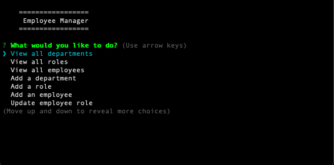

# Brians Employee Tracker

[](https://opensource.org/licenses/MIT)

## Description
Developers frequently have to create interfaces that allow non-developers to easily view and interact with information stored in databases. These interfaces are called content management systems (CMS). Brians Employee Tracker is a command-line application created from scratch to manage a company's employee database, using Node.js, Inquirer, and MySQL.

## Table of Contents
* [Tools](#tools)
* [Mock Up](#Mock-Up)
* [Instructions](#Instructions)
* [User Story](#User-Story)
* [Acceptance Criteria](#Acceptance-Criteria)
* [Delivarables](#Delivarables)
* [Walkthrough Video](Walkthrough-Video)
* [Technical Acceptance Criteria](#Technical-Acceptance-Criteria)
* [Repository Quality](#Repository-Quality)
* [Application Quality](#Application-Quality)
* [Bonus](#Bonus)
* [Submission](#Submission)

### Tools
- Express.js
- Node.js
- HTML
- JavaScript
- CSS

### Mock Up



## Instructions
1. Clone the main project, then open the cloned file.
2. Make sure you are in the main project folder using the 'cd' command.
3. Open command prompt and run: npm install
4. To start the application, load it up in your IDE type in terminal: node app
5. From there, you can choose how you want to view, retrieve, delete and edit the SQL data through a sequence of command line prompts.
6. Initialize the NPM registry using: ```npm init -y```
7. Navigate to the .env file provided in this repository and edit the empty strings for 'user' and 'password' to contain your MySQL login information.
8. Run ```mysql -u root -p``` to login into sql.
9. Run the following code lines to initialize the database and pre-populate its tables:
- ```source db/db.sql```
- ```source db/schema.sql```
- ```source db/seeds.sql``` 
10. Install the required packages using: 'npm i'
11. Call the application using: node app
12. Enjoy the Application 


### User Story
* AS A business owner
* I WANT to be able to view and manage the departments, roles, and employees in my company
* SO THAT I can organize and plan my business

### Acceptance Criteria:
* GIVEN a command-line application that accepts user input
* WHEN I start the application
* THEN I am presented with the following options: view all departments, view all roles, view all employees, add a department, add a role, add an employee, and update an employee role.
* WHEN I choose to view all departments
* THEN I am presented with a formatted table showing department names and department ids.
* WHEN I choose to view all roles
* THEN I am presented with the job title, role id, the department that role belongs to, and the salary for that role. 
* WHEN I choose to view all employees
* THEN I am presented with a formatted table showing employee data, including employee ids, first names, last names, job titles, departments, salaries, and managers that the employees report to.
* WHEN I choose to add a department
* THEN I am prompted to enter the name of the department and that department is added to the database.
* WHEN I choose to add a role
* THEN I am prompted to enter the name, salary, and department for the role and that role is added to the database. 
* WHEN I choose to add an employee
* THEN I am prompted to enter the employee’s first name, last name, role, and manager, and that employee is added to the database. 
* WHEN I choose to update an employee role
* THEN I am prompted to select an employee to update and their new role and this information is updated in the database.

### Delivarables
* Your GitHub repository containing your application code.

### Walkthrough Video
* A walkthrough video that demonstrates the functionality of the employee tracker must be submitted, and a link to the video should be included in your README file.
* The walkthrough video must show all of the technical acceptance criteria being met.
* The walkthrough video must demonstrate how a user would invoke the application from the command line.
* The walkthrough video must demonstrate a functional menu with the options outlined in the acceptance criteria.
* Link: https://drive.google.com/file/d/1pP0miQj_RXYGd4TllBr0crGr4ebgH14_/view

### Technical Acceptance Criteria
* Satisfies all of the preceding acceptance criteria plus the following:
- Uses the Inquirer packageLinks to an external site..
- Uses the MySQL2 packageLinks to an external site. to connect to a MySQL database.
- Uses the console.table packageLinks to an external site. to print MySQL rows to the console.
* Follows the table schema outlined in the homework instructions.

### Repository Quality
* Repository has a unique name.
* Repository follows best practices for file structure and naming conventions.
* Repository follows best practices for class/id naming conventions, indentation, quality comments, etc.
* Repository contains multiple descriptive commit messages.
* Repository contains a high-quality README with description and a link to a walkthrough video.

### Application Quality
* The application user experience is intuitive and easy to navigate.

### Bonus
* Fulfilling any of the following can add up to 20 points to your grade. Note that the highest grade you can achieve is still 100:
1. Application allows users to update employee managers (2 points). Done
2. Application allows users to view employees by manager (2 points).
3. Application allows users to view employees by department (2 points).
4. Application allows users to delete departments, roles, and employees (2 points for each).
5. Application allows users to view the total utilized budget of a department—in other words, the combined salaries of all employees in that department (8 points).

### Submission
* Date Submitted: October 19, 2022
* You are required to submit BOTH of the following for review: 
1. A walkthrough video demonstrating the functionality of the application: https://drive.google.com/file/d/1pP0miQj_RXYGd4TllBr0crGr4ebgH14_/view
2. The URL of the GitHub repository, with a unique name and a README describing the project: https://github.com/bslockhart/Brians-Employee-Tracker